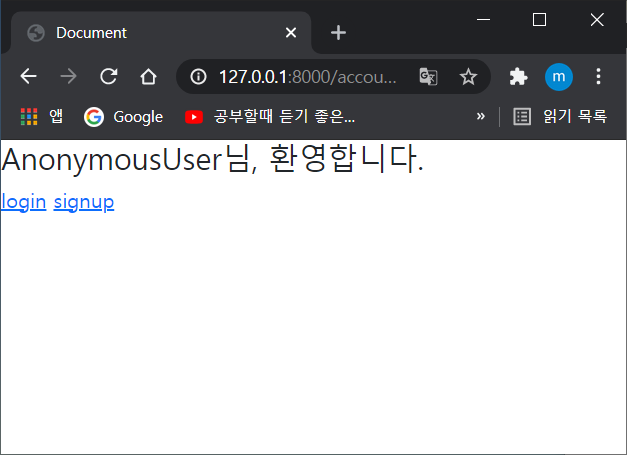
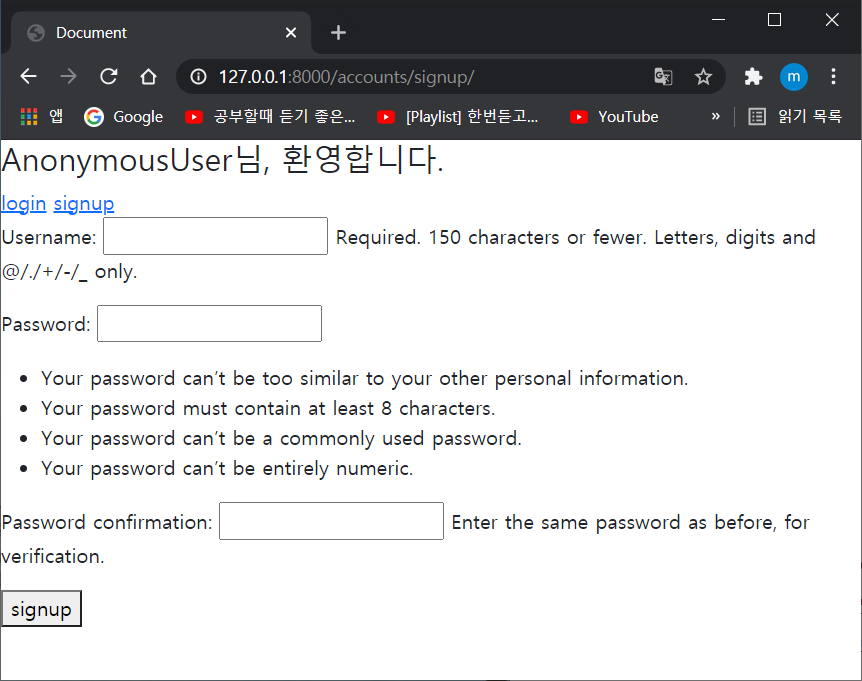
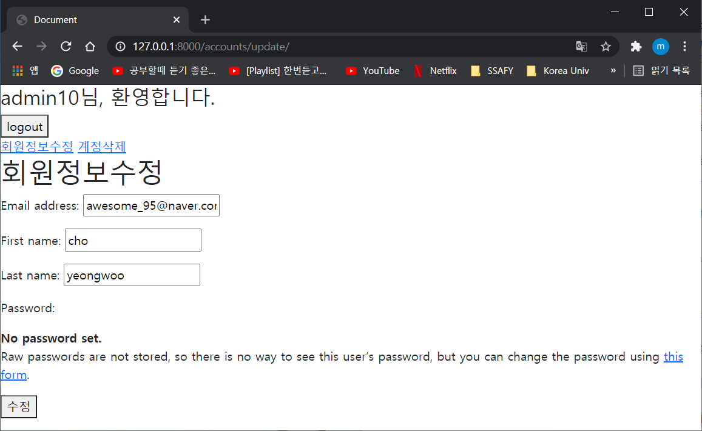
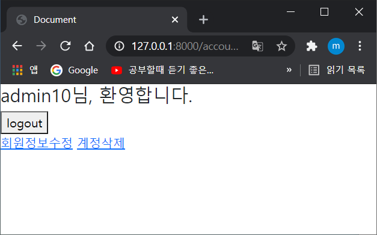

# 회원가입, 로그인, 로그아웃, 정보업데이트, 삭제

* 제일 처음으로 하는 설정들, 우린 알고있다.

  * 가상환경 설정하기, django설치

  * requirements.txt가 있다면 그것들 데려와서 설치해주기 `pip install -r requirements.txt` 

  * pjt, app 설치하고 등록하기, app에 등록해주듯이 그대로 해주기, urls.py분리해주고, migrate한번  실행

    * ```
      pip install -r retuirements.txt
      # requirements.txt파일이 있을경우
      pip install django
      ```

    * ```
      # config/urls.py url분리해주기
      path('accounts/', include('accounts.urls')),
      ```

    * ```
      # 넣어둔 정보는 없지만, 그냥 migrate실행
      python manage.py migrate
      ```

  * base.html 생성하고, 그 안에 값들을 넣어주는데, if else를 활용해서 로그인이 되어있을 때에 보여줄 것들과, 로그아웃이 되어있을때 보여줄 것들을 구분해서 적어놓기

    ```python
    
    # 만약 유저아이디가 로그인이 되어있다면?
      <form action="" method="POST">
      # logout은 메서드방식이 필요해서, form태그를 활용해서 적어줌
      
        #POST라면 짝꿍
      <button>logout</button> # 눌러줘야지
      </form>
      <a href="">회원정보수정</a>
    	# 로그인일때 회원정보도 보여줘야지
      <a href="">계정삭제</a>
    	# 로그인일때 계정을 삭제하는 것도 보여줘야지
     # 로그인이 안되어있다면??
      <a href="">login</a>
        # 로그인항목과
      <a href="">signup</a>
    	# 회원가입항목을 보여줘야지
     # if문은 여기까지
    ```

    이친구들을 한꺼번에 다 적어 줄 필요는 없다. 순서대로 말하자면, 회원가입, 로그인, 로그아웃, 수정, 삭제. 이순서대로 차례차례 추가해주면서 하면 된다. 그냥 큰 틀은 이렇다는걸 잊지말자..

  * base.html을 생성해줬으면 뭘해야될까, 당연 base.html의 경로를 등록해줘야한다.

    ```
    # config/settings.py
    
    'DIRS': [BASE_DIR / 'config' / 'templates'],
    ```

    html이 들어있는  templates폴더가 젤 마지막에 올때까지 폴더를 까주면 된다. 만약 templates폴더가 프로젝트와 앱폴더와 같은 위치에 있다면 2번째에 바로 templates가 들어오면 된다.

    

* 얼추 기초가 끝났다면 이제 app폴더로 가서 하나씩 만들어보자.

  * # 회원가입 

    * url분리해주기는 해줬으니, 이제 분리된 앱폴더로가서 urls.py를 생성해준다.

      ```
      # urls.py / 기본적으로 불러줘야할 아이들 / 그냥 숨쉬듯이 불러주자, 장고주소길~ 쩜~ 뷰~스
      from django.urls import path
      from . import views
      
      app_name = 'accounts'
      urlpatterns = [
          path('',views.index, name="index"),
          path('signup/',views.signup, name='signup'),
          ]
          # 처음 주소는 index로 기본적으로 하나 만들어두고 시작하는걸로
          # 회원가입을 한다한들, 회원가입 들어가기전에 대문은 있어야 할것이니..
          # 그리고 회원가입하는 signup도 같이 만들어주자
      ```

    * 그다음 def를 정의해주자 내가 지금 2가지의 path를 만들고왔으니, 적어도 2개는 만들어야겠지. index, signup

      * 시작 전, 내가 여기서 쓸 아이들을 import해와야 한다. 예전과는 달리 이제는 form을 청승맞게 하나하나 치고있지 않을것이다. 바로 데려올것이다. 장고로부터

      * 자 그럼 index(첫페이지)에는 어떤것이 있나? 여기선 할게없다. 회원가입도 뭐도 할것이 없고, 그저 첫페이지, 대문이니까 base에서 설정해줬던 것처럼, 회원로그인이 되어있다면, 로그아웃, 삭제를 보여주고, 로그아웃이 되어있다면, 로그인과 회원가입링크를 보여주기만 하면된다.

      * 그래서

        ```python
        # views.py
        
        def index(request): # index함수는
            return render(request, 'accounts/index.html') # index페이지를 반환한다.
        ```

        ```python
        # accounts/index.html
        
        
        
        
        ```

        

        index페이지는 저렇게 퀭한데 왜이럴까?

        당연, base.html에 값을 저장해뒀으니까 상속받아오니 기본적으로 뜨는거지.

        그리고 로그인되지 않은 상태에서 user를 부르면 `AnonymousUser`라고 출력이된다.

      * ### signup

        * signup은, CRUD에서 C와 같다. 생성. 그러니까, POST로 걸러주고, 유효성검사로 걸러주고, 그런 작업을 똑같이 반복해주면 된다. 그치만 차이점이라함은, 여기선 Form을 forms.py서 불러오는게 아니라 django에서 바로 불러와 사용하면 된다.

          ~~form일 경우에는 같은 forms.에서 불러오면 된다.(django.contrib.auth.는 기본)

          ```python
          from django.contrib.auth.forms import UserCreationForm
          # 이름만 들어도 유저를 create하는 form
          ```

          ```python
          from django.contrib.auth import login as auth_login
          # 이건 로그인을 할때 필요한 친구인데, 함수이름이 login이라서 중복이 되서 에러가 발생한다. 그러니까, as를 이용해 별칭을 지어주도록 as auth_login
          ```

        * ```python
          def signup(request):
              if request.method == 'POST': # POST인지 판별
                  form = UserCreationForm(request.POST)
                  # 신규가입 = 서버에서는 우리사람이라고 확실하게 인식할 수 있음
                  if form.is_valid(): # 유효성 검사
                      # form.save()
                      # 저장을 할 때에 user 정보를 활용하면 가입과 동시에 로그인을 할 수 있을것임
                      user = form.save() # user에다가 form값 받은거 저장해줌
                      auth_login(request, user)
                      # 이 한줄로 바로 로그인을 시켜줌. user데이터를 이용해서, user정보를 같이넣어줌
                      return redirect('accounts:index')
              else: # POST가 아닐경우
                  form = UserCreationForm()
                  # 폼에 빈공간으로 그대로 저장
              context={ # context담아서
                  'form':form, 
              }
              return render(request, 'accounts/signup.html', context)
              # context까지 같이 반환해준다.
          ```

          ```python
          # accounts/login.html
          
           # 상속받자~
          
              <h1>login</h1> # 제목
              <form action="" method="POST"> # 메서드는 POST, 정보를추가하는거
              # action이 비어있는 이유는, 이 login페이지를 실행시켜주면 def login을 또 실행시켜 줄거기 때문에
               # POST의 짝꿍 csrf 까먹지말기!
              {{ form.as_p }} # form태그로 깨작깨작 쓰지말고 한줄로 깔끔하게마무리!
              <button>로그인</button> # form태그는 input이나 button을 꼭 써줘야됨
          </form>
          
          ```

          

          form.as_p를 활용하니 그냥 깔끔하게 나옴. views.py에서 내가 UserCreationForm을 불러왔기 때문에 그걸 form에 저장해서 form.as_p로 출력. 아주그냥 착착착 떨어진다.

      * ### Login

        * login에서 사용할 form : `AuthenticationForm()`. 여기서의 경로 또한 생각보다 단순하다. `django.contrib.auth.forms`으로부터 import해주면 된다. ~~form일 경우에는 같은 forms.에서 불러오면 된다.

          ```python
          from django.contrib.auth.forms import AuthenticationForm
          ```

          url path설정하는것도 잊지말고..!!

          ```python
          def login(request):
              # POST인지 검사
              if request.method == 'POST':
                  # AuthenticationForm에 request한, 요청받은 값들을 집어넣어 주는데, 여기서 첫번째 인자값은 무조건 request이다. 그 다음에 POST메서드로 요청받은 값인, request.POST를 넣어준다.
                  form = AuthenticationForm(request, request.POST)
                  # 유효성 검사(이건 이제 항상 해줘야하는 것 같다.)
                  if form.is_valid():
                      # 로그인을 해주는 함수login인데 함수와의 이름을 중복을 피하기위해 별칭 auth_login을 사용했다. 로그인을 해주려면 값이 있어야겠지? 이것도 첫번째 인자가 request인가보다, 
                      # 그리고 그다음 form.get_user()인데 이 모델을 풀어서보면, 아까 request.POST로 요청받은것을 form에 넣어줬는데 그 form에서 get찾는다_user()를.
                      auth_login(request, form.get_user())
                      # 로그인을 해준 다음에 이제, 첫화면으로 돌아가준다.
                      return redirect('accounts:index')
                  	# redirect를 해주기 위해 import하는것 잊지말기!
              else: # 메서드가 POST가 아니라면?
                  form = AuthenticationForm() #또 form에다가 값 없이 그냥 놔둠
              context = {
                  'form':form,
              }
              return render(request, 'accounts/login.html', context)
          	# 메서드가 다르든, 유효성검사에서 탈락하든, 그러면 login페이지를 다시 돌려줌
          ```

          ```python
          # accounts/login.html
          
          
          
          <h1>login</h1>
          <form action="" method="POST"> #메서드는 POST에 action은 주소login또부를거라서 비워두면됨
              
              {{ form.as_p }} # AuthenticationForm을 p형태로 자동으로 만들어주는 신기함
              <button>로그인</button> # form태그가 있으니 당연히 button도
          </form>
          
          ```

      * ### Logout

        * logout은 생각보다 간단하다. 이것또한 logout해주는 함수가 필요한데

          ```python
          from django.contrib.auth import logout as auth_logout
          ```

          여기서 logout을 불러오서 사용하는데 여기도 마찬가지로 함수명과 겹치기 때문에 별칭으로 auth_logout으로 변경해준다.

          ```python
          def logout(request):
          	if request.method == 'POST': # POST인지 확인
          		auth_logout(request) # logout은 session이 이미 생성되어있기 때문에, 애초에 user값을 요구하지 않는다, 그래서 request(들어온 정보만 가지고 logout실행)
          	return redirect('accounts:index') # 첫페이지로 가보자~
          ```

        * logout은 별다른 html이 필요없다. 버튼누르면 그냥 request정보가지고 auth_logout 실행시키고 끝이기 때문에, 뭔가를 입력하고 작성하는 폼자체도 필요가없다. 그래서 이건 여기서 끝.

      * ### Update

        * update는 CRUD의 뭐지? U이다. 수정!

        * url설정해주고, 여기서는 UserChangeForm을 활용해줄거다. 그런데, 그냥 사용하면 안되고, Custom을 해서 CustomUserChangeForm을 이용해볼거다.

          먼저 이 폼을 설정해주기 위해서 forms.py를 생성해보자.

          ```python
          from django.contrib.auth import get_user_model
          # user모델을 얻기 위한 import, 중간업체일 뿐임
          from django.contrib.auth.forms import UserChangeForm 
          # 폼설정 해주기위해
          
          # class CustomUserChan
          
          class CustomUserChangeForm(UserChangeForm):
              # update에서 사용할 클래스 생성해주자
              class Meta:
                  model = get_user_model()
                  # 모델은 항상 중간업체를 낀다. 이 친구도 import해주기
                  # 객체 인스턴스를 리턴하는데, 어쩔땐 none이 리턴될수도있음
                  fields = ('email', 'first_name', 'last_name')
                  # 필요한 필드는 얘네들, 리스트가아니라 튜플로 묶여있음..
          ```

          form을 만들어줬으니 이제 views로 돌아가서 CustomUserChangeForm을 사용해보자.

          ```python
          def update(request):
              # 얘는 다른데도 써도 될 것 같음, 로그인이 되어있지 않는경우 접속하지 못하도록
              if not request.user.is_authenticated:
                  #로그인이 되어있지 않다면?
                  return redirect('account:login')
                  # 로그인창으로 돌려보냄
                  #POST 검사
              if request.method =='POST':
                  form = CustomUserChangeForm(request.POST, instance=request.user)
                  # form에 값넣어주는데, 사용자에게 입력받은 값 넣어주고, 
                  # instance로 유저정보를 미리 넣어주기
                  if form.is_valid:
                      # 유효성 검사 실행
                      form.save()
                      # 저장
                      return redirect('accounts:index')
                      # index로 돌아가도록
              else:
                  form = CustomUserChangeForm(instance=request.user)
                  # 그대로 사용하면 안되고(UserChangeForm) Custom한번 해줘야함 forms.py로 가서 설정
                  # update니까 instance만들어주고 유저정보(request.user)를 넣어줌
              context={
                  'form':form,
                  # form을 컨텍스트에 전달해준다
              }
              return render(request, 'accounts/update.html', context)
          ```

          request한 유저정보를 가져올때에는 request.user 를 사용하나봄ㅇ.ㅇ

          ```python
          
          
          <h1>회원정보수정</h1>
          <form action="" method ="POST">
          # 여기서도 수정눌러서 def update를 실행해주기 위해서 비워둔다.
          # 메서드는 POST
              
              # csrf는 짝꿍
              {{ form.as_p }}
              # CustomUserChangeForm를 또 간단하게 as_p로 예쁘게 표현해주기~
              <button>수정</button>
          </form>
          
          ```

          

          ```
              if not request.user.is_authenticated:
                  #로그인이 되어있지 않다면?
                  return redirect('account:login')
                  # 로그인창으로 돌려보냄
          ```

          이친구를 다시 한번 살펴보면, is_authenticated가 현재 로그인이 되어있는지 안되어있는지르 판별해준다. base.html에서도 사용되는데, if 문으로 구별해주면  상황에 따라 필요한 항목만 볼 수 있어서 더 편하지 않을까싶다. 로그인되어있는데, 로그인항목을 볼 필요는 없으니까

      * ### Delete

        * urls.py설정하고, (아 그러고보니, 이번 계정관리편에서는 pk값을 안써서 좀 편한느낌이다.)

        * views.py설정하는데, 그전에 import 해줘야할 것이 없는지 확인해보자. 없네..?

          ```python
          def delete(request):
              if not request.user.is_authenticated:
                  return redirect('account:login')
                  # 로그인 하지 않았다면, login창으로 보내버림
              if request.method=="POST":
                  # 로그아웃 시켜버리기, 쿠키제거 하면서 / 삭제보다 먼저와서, 먼저 로그아웃을 시켜줘야함
                  request.user.delete()
                  # 계정을 삭제함
                  auth_logout(request)
                  #로그아웃 해주기. logout함수는 user정보가 필요가없음. request만 필요함
                  # 순서로 이야기가 나왔었는데, 로그아웃을해주게되면 request의 정보가 없어지나봄..? 그래서 계정을 먼저 삭제해 준 다음에 로그아웃을 해주나봄. 정보가 사라지기 전 삭제를 해줘야하니까? 근데 왜 난 둘다 같은말같지.... 흠...
              return redirect('account:index')
          ```

          html도 필요없다. 삭제하면 그냥 안녕...

          

          ​	

      * ### Password 변경

        * 비밀번호 변경하는것... 난 처음에 되게 어려울 줄 알았다.. 근데뭐 따라하니까 괜찮았다. 전제는 따라했다는거에 포커스를 맞춘다면..ㅋ..

        * url미리 설정해둔다. 그다음 view로 떠나자(항상 view가 제일 복잡하다)

        * 여기서 필요한 Form은 무엇일까 : PasswordChangeForm() 이것도 너무 표현이 직관적이지 않나? 외우기는 편해서 좋을것 같다. 너무 많아서 그렇지...

          ```python
          from django.contrib.auth.forms import PasswordChangeForm
          # 비밀번호변경을 위한 Form
          from django.contrib.auth import update_session_auth_hash
          # 이름으로 유추하였을때 내가 비밀번호를 바꿨으니까, 그 세션에도 변화를 적용시켜줘야하지 않을까? 그 작업을 위해 데려오는 아이인것 같다.
          ```

          ```
          def password(request):
              if not request.user.is_authenticated: # 만약 로그인하지 않았더라면..?
                  return redirect('accounts:login') # 로그인창으로 돌아가
                  #얘는 계속나온다. 그냥 로그인없이 접속하면 안될것 같은 곳에는 다 적어주는것이 차라리 맘편할 수도 있다.
              if request.method == 'POST':
                  # 메서드 검사
                  form = PasswordChangeForm(request.user, request.POST)
                  # form에다 Form을 활용해서, 유저정보랑, 받은 정보를 두개 넣어준다.
                  # 첫번째인자에 현재유저정보를 넣어주고, 두번째 인자에 내가 바꾸고싶은 입력받은 POST로 받은 값을 넣어주는걸로
                  if form.is_valid():
                  # 유효성 검사
                      user = form.save()
                      # user에 form값을 저장
                      update_session_auth_hash(request, user) # 유저정보도 넣어줘야함
                      # 업데이트를 하면서 로그인이 안풀리게 방지해줌
                      # 이 친구도 django.contrib.auth에서 가져오면됨
                      return redirect('accounts:update')
              else:
                  form = PasswordChangeForm(request.user)
                  # 입력폼의 이름은 PasswordChangeForm > import해주기 > 첫번째 인자로 무조건 user정보가 들어가야함.
              context={
                  'form':form,
              }
              return render(request, 'accounts/password.html', context)
          ```

          