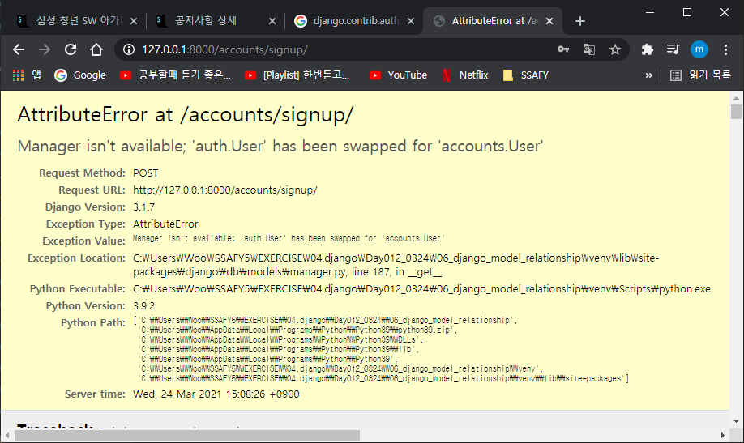
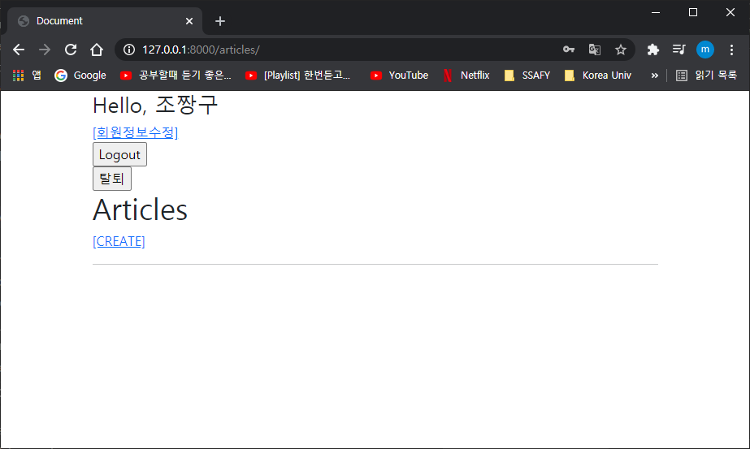
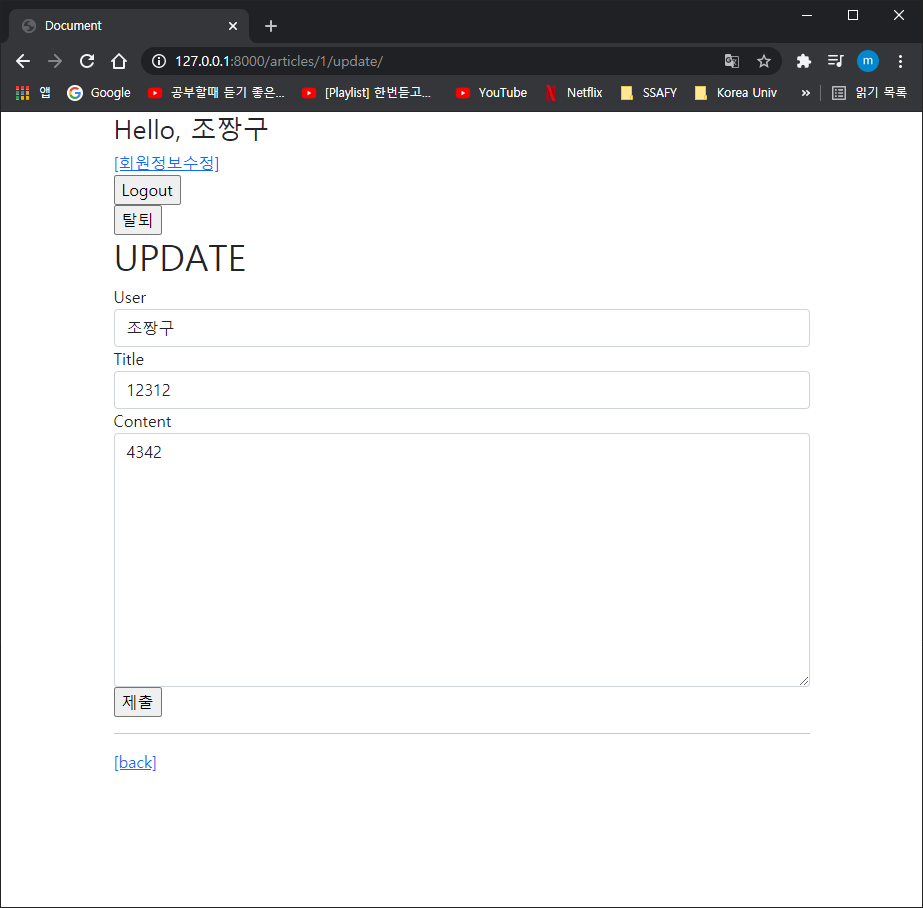

# Comment CRD

```python
def comments_create(request,pk):
    if request.user.is_authenticated: # 유저라면 할 수 있도록 설정해주기
    
    
    # 기존의 값들 들여써주기
    
    return redirect('accounts:login')
	# 유저라면 가정문에서 튕기면 login창으로 돌아감
    
```

```python
# @login_required 안써주는게 좋음
@require_POST # 흐름상 막히게됨 GET을 막기 때문에 405에러발생
def comments_delete(request, article_pk, comment_pk):
    if request.user.is_authenticated: # 유저라면 할 수 있도록 설정해주기
        comment = get_object_or_404(Comment, pk=comment_pk)
        comment.delete()
        return redirect('articles:detail', article_pk)
    return redirect('accounts:login') # 로그인 안했다면, 로그인페이지로 보내버리기
```

비인증 사용자라면? 그런걸 좀 알려주고싶다면(추가개념, 시험범위는 아님)

```python
from django.http import HttpResponse
```

```
return HttpResponse(status=401)
# 이렇게 해주면 번호에 맞는 에러를 통해 알려줌
```


401에러를 발생시켜줌. (로그아웃된 상태에서 댓글작성을 클릭했을 때)

- django response request
- 

- 댓글이 몇개인지 확인하기

```
# detail.html

  <h4>댓글목록</h4>
  {{ comments|length }} 개
  {{ article.comment_set.all|length}} 개
  {{ comments.count }} 개 # comments라는 것에 함수를 또 호출하는것임. 엄밀히 따지자면 1,2번째를 사용하는게 좋음
```


```python
    
      <p>아직 댓글이 없네요...</p>
      # endfor 전에 살짝 넣어주면 비어있으면 댓글없다고 알려줌
```


# Customizing authentication in Django

기존유저모델을 재정의하는 것임 `AUTH_USER_MODEL`설정을 제공하여.... 재.정.의!!

custom model을 참조해서.

프로젝트 만들때부터 그냥 처음부터 customizing 해라. 다른거필요없다. 해라그냥

대체해주고 안해주고의 차이는 나중에 커스텀을 할수있냐없냐의차이라고함.

(django custom authentication) 인증에 관해서 custom을 해주는 건데 구글검색ㄱㄱ

settings.py에서 AUTH_USER_MODEL = 'myapp.MyUser' 설정해주기

1. ```python
   settings.py
   
   AUTH_USER_MODEL = 'accounts.User' # 대체하는작업
   ```

2. app/models.py로 가서

   ```
   from django.db import models
   from django.contrib.auth.models import AbstractUser
   # Create your models here.
   
   class User(AbstractUser):
   # 왜 AbstractUser를 사용하나??
       pass # 왜 pass인가? 나중에 바꾸고싶을때 그 여지를 놔두기위해서 일단 pass
   ```

3. 기본 값은 'auth.User'

   1. 프로젝트가 진행되는 동안 변경할 수 없음(변경은 가능하나.. 너무많은노력필요)
   2. 프로젝트 시작 시 설정하기 위한 것, 

- 초기화해주기. 프로젝트의 첫 마이그레이션전에 대체가 끝나기위해
  - 만약 프젝중간이라면 migrations를 전부 지워버리기. 폴더를 지우는게 아니라 0001,0002 ..~ 얘네들을 다 지워버림
    - 설계도를 기반으로해서 db.sqlite3도 지워버리기
    - 그 다음 makemigrations 실행
    - accounts/migrations 들어가보면 User모델의 뭔가들이 마구마구 들어있음
    - 최종적으로 migrate 실행

- 회원가입을해서 저장되는지 확인해보기

  

  에러가 발생함...  'auth.User' has been swapped for 'accounts.User'

  지금 유저모델이 accounts.User로 바뀌었다.. 어떻게해줘야되냐?? 재정의필요

  UserCreationForm, UserChangeForm

  ```
  class CustomUserChangeForm(UserChangeForm):
  
      class Meta:
          model = get_user_model()
          fields = ('email', 'first_name', 'last_name',)
          
          # 얘는 직접참조하지말고 get_user_model로 참조한거라 user를 return 해줌. 현재 user가 아니라 활성화되어있는 것들을. 그래서 User 직접참조 제발 하지말고 얘를 갖다써라!!
  class CustomUserCreationForm(UserCreationForm):
      class Meta(UserCreationForm.Meta):
          model = get_user_model()
          fields = UserCreationForm.Meta.fields + ('email',)
          # UsercreationForm안에, Meta정보안에 있는 fields를 그대로 쓰겠다.
          # +로 더 보고싶은 필드를 작성
  ```

  ```
  # views.py
  from .forms import CustomUserChangeForm, CustomUserCreationForm
  ```

  ```
      if request.method == 'POST':
          form = CustomUserCreationForm(request.POST)
          if form.is_valid():
              user = form.save()
              auth_login(request, user)
              return redirect('articles:index')
      else:
          form = CustomUserCreationForm()
      context = {
          'form': form,
  ```

  여기원래 UserCreationForm > CustomUserCreationForm으로 변경

  

  회원가입완료!!

- 하나의 유저는 여러개의 게시글을 가질 수 있다. 1:N(articles)

  - field가 어디에작성되어야할까??? articles/models.py

    유저를 참조하는 방법이 하나 있음 

    ```
    #articles/models.py
    from django.conf import settings
    
    class Article(models.Model):
    	user = models.ForeignKey(settings.AUTH_USER_MODEL, ON_delete=models.CASCADE) # 추가
    
    ```

    첫번째방법은 settings.AUTH_USER_MODEL

    -  M:N관계를 정의할 때 사용함
    - 즉, models.py에서 유저모델을 참조할 때 사용함

    두번째 : get_user_model() -

    - django에서는 모델을 직접참조대신 이걸쓰라고했으나..
    - 위 models.py를 제외한 나머지에서는 다 사용됨.

  - makemigrations 실행하면

    ```
    You are trying to add a non-nullable field 'user' to article without a default; we can't do that (the database needs 
    something to populate existing rows).
    Please select a fix:
     1) Provide a one-off default now (will be set on all existing rows with a null value for this column)
     2) Quit, and let me add a default in models.py
    Select an option:
    ```

    1번 선택하고 쭉쭉간다

  - 다 하고나니까....

    

    이름을 선택하게냅두는데.. 없애줘야지

    ```python
    # articles/forms.py
    
    class ArticleForm(forms.ModelForm):
    
        class Meta:
            model = Article
            fields = ('title', 'content')
    ```

    fields를 지정해준다 2개만 나오도록