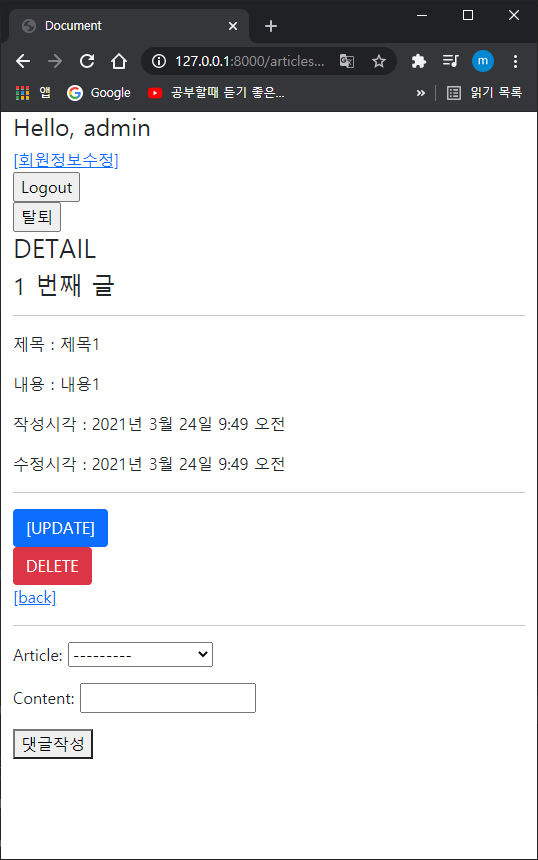
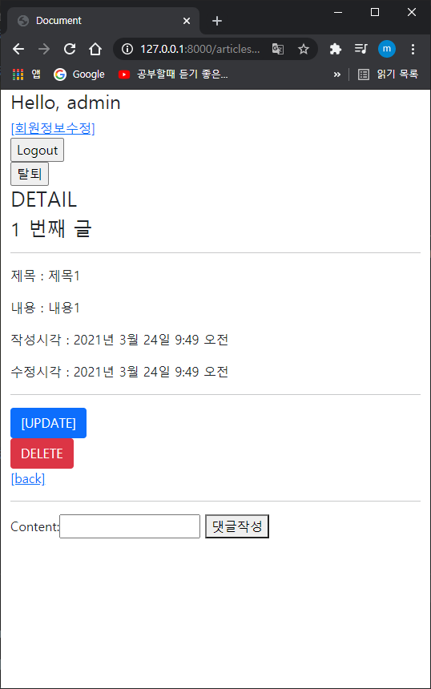
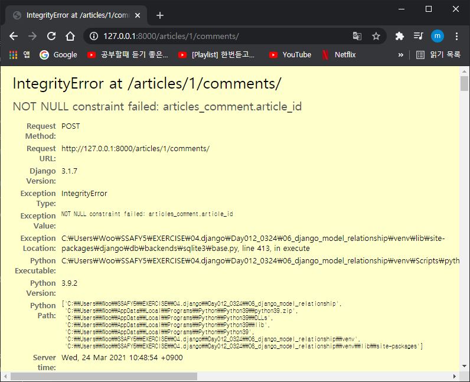
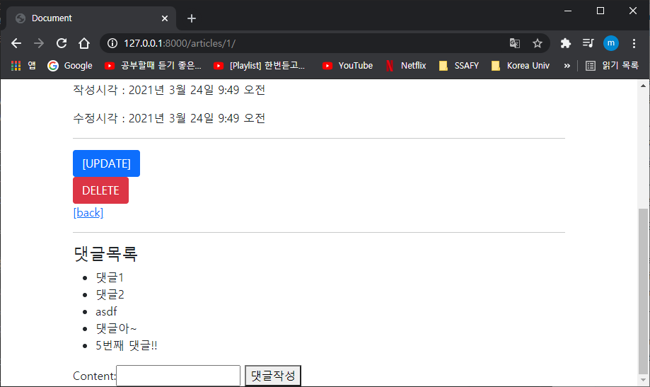
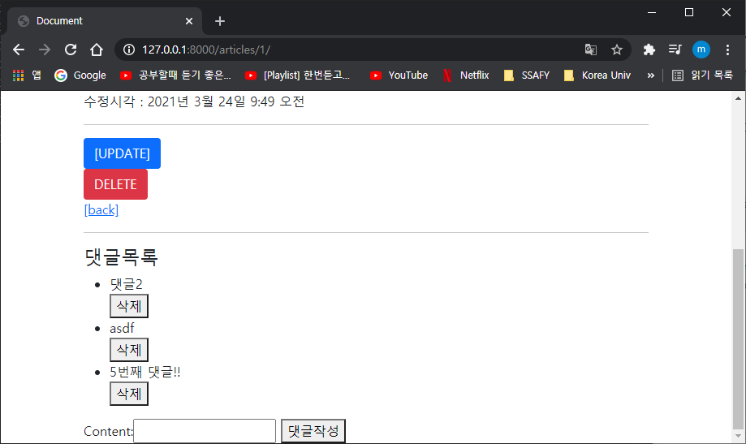

* authentication_builtin Form
  * AuthenticationForm, UserCreationForm, (Custom)UserChangeForm
* 로그인제한
  * is_athenticated:, login_required


# Relationship fields

1:n = forienKey(article:comment) 외래키

manytomany

onetoone


* Article, comment의 테이블을 살펴볼때, 커멘트가 어디에 생성되었는지 표기해주려면 고유값인 pk를 작성해주는데

  1:N일 경우엔 N에 작성이됨

  Foreign Key 외래키

  한 테이블(comment)의 필드 중, 다른 테이블(article)의 행을 식별할 수 있는 키

  참조하는 행 여러개가 참조되는 행 하나를 지칭한다. Article에 여러개 comment달렸다는 이야기

* 참조무결성

  컴퓨팅 분야서 완전한 수명주기를 거치며 데이터의 정확성과 일관성을 보증하는 것.

  pk값을 참조. 

* on_delete

  foreignkey가 사라졌을 때, 그 키값을 가진 객체를 어떻게 처리할지 정의


# 실습

## 댓글모델 구현

articles에 댓글모델을 구현해보자.

* models.py

  ```python
  #클래스 생성(모델틀을 가져와서)
  class Comment(models.Model):
      # 참조하는 모델에 대한 외래키 작성, 모델명은 소문자 (참조할모델, on_delete)
      article = models.ForeignKey(Article, on_delete=models.CASCADE)
      # 댓글만 쓰면되니까, content 하나만. 거기다 보통 댓글을 제한이있으니 charfield를
      content = models.CharField(max_length=200)
      # 댓글 작성시간과 수정시간도 같이 표현해주기
      created_at = models.DateTimeField(auto_now_add=True)
      updated_at = models.DateTimeField(auto_now=True)
      # 실제 데이터상에선 5개의 컬럼이 만들어질거라고함
  
      # shell_plus에서 몇번댓글인지 보기 편하게 하기 위해 설정
      def __str__(self):
          return self.content
  ```

  기존에 있던 모델에 변경(수정, 추가, 삭제 등등)사항이 생기면 migrate를 해줘야함. make부터해주기~

  0002 살펴보면 외래키는 맨 뒤에붙음. article은 맨처음 만들었는데... 이건 무조건인가봄

  db열어보면 article에는 댓글과 관련된 어떠한 것도 들어있지 않음

  articles_comment로 들어가보면 있음 외래키는 article_id로 만들어졌음

* shell_plus 작성

  ```
  $ python manage.py shell_plus
  ```

  ```python
  # In [1] 은 잘못써서 2부터 시작..ㅎ..
  
  In [2]: comment = Comment()
  
  In [3]: comment
  Out[3]: <Comment: >
  
  In [4]: comment.content = '댓글1' # 댓글입력
  
  In [5]: comment.save() # 여기서 에러가 발생함
  # 댓글 내용과 몇번 게시글에 작성이 되는지(article_id), 2가지가 필요함
  ```

  ```
  In [6]: Article.objects.create(title='제목1', content='내용1')
  # save안해줘도 알아서 저장해줌
  Out[6]: <Article: Article object (1)>
  
  In [7]: Article.objects.all()
  Out[7]: <QuerySet [<Article: Article object (1)>]>
  #쿼리값 나옴
  
  In [8]: comment.content
  Out[8]: '댓글1'
  
  In [9]: comment.article_id = article의 PK가 필요함
  # 9번은 쓰지마
  ```

  ```python
  In [10]: article = Article.objects.get(pk=1)
  # 게시글 pk 1인것 불러오기
  In [11]: article
  Out[11]: <Article: Article object (1)>
  # 현재 article은 (1)
  
  In [12]: comment.article = article
  # 이걸로 코멘트의것을 아티클에 넣어주면 자동으로 들어가짐
  
  In [13]: comment.article
  Out[13]: <Article: Article object (1)>
  # 쿼리값이 나온다. 1번이라고
  
  In [14]: comment.save()
  # 그것을 저장해주기
  
  In [15]: comment.pk
  Out[15]: 1
  # comment가 1에 저장된것을 볼 수 있음
  ```

  ```
  In [18]: comment.article
  Out[18]: <Article: Article object (1)>
  # comment가 참조하고있는 article
  In [19]: comment.article_id
  Out[19]: 1
  # comment가 참조하고있는 article의id. (article.pk라고해도 똑같음, 대신, article_pk는 안됨)
  ```

  지금 설정된 article에 두번째 댓글을 작성함

  ```python
  In [21]: comment = Comment(content='댓글2', article=article)
  
  In [22]: comment.save()
  
  In [23]: comment.content
  Out[23]: '댓글2'
  
  In [24]: comment.article
  Out[24]: <Article: Article object (1)>
  
  # comment가 참조하는 article의 pk
  In [25]: comment.article_id
  Out[25]: 1
  
  In [26]: comment.article.pk
  Out[26]: 1
  ```

  * 그 다음 admin에도 등록해준다.

  ```python
  from django.contrib import admin
  from .models import Article
  from .models import Comment
  
  # Register your models here.
  admin.site.register(Article)
  admin.site.register(Comment)
  ```

  관리자도 생성해주기

* 참조할때 1:N입장에서... comment_set(모델이름\_set)

  ## 역참조

  ```python
  In [1]: article = Article.objects.get(pk=1)
  # pk=1인 article 데려오기
  
  In [2]: article
  Out[2]: <Article: Article object (1)>
  #현재 article값 알려줌
  
  In [3]: article.comment_set.all()
  # 역참조로 pk=1인 article의 모든 comment값들을 반환
  Out[3]: <QuerySet [<Comment: 댓글1>, <Comment: 댓글2>]>
  ```

* 댓글도 modelform을 생성해주자(써주기위해 ㅎ)

  ```python
  class CommentForm(forms.ModelForm):
      class Meta:
          model = Comment
          fields = '__all__'
  ```

  ```
  # views.py/def detail
  from .forms import ArticleForm, CommentForm
  
  def detail(request, pk):
      article = get_object_or_404(Article, pk=pk)
      comment_form = CommentForm() # 추가된항목
      #댓글은 디테일 내부에서 입력받을 것이기 때문에
  ```

  ```
  # detail.html 맨 밑에
  
    <form action="#" method="POST">
    
    {{ comment_form.as_p }}
    <button>댓글작성</button>
    </form>
  ```

  

  맨 밑의 article선택하는 창이 있음. 굉장히 거슬림, 필요없는 항목이기 때문에.... 난 지금 1번게시물에 들어와있으면, 1번 게시물에 대한 댓글만 작성하면 됨. 즉, Article선택은 사용자로부터 받는것이 아님. 받는건 댓글의 내용뿐

  ```
  class CommentForm(forms.ModelForm):
      class Meta:
          model = Comment
          fields = '__all__'
          exclude = ('article',)
          # article은 보여줄 필요가 없으니, 예외항목에 넣어주기
  ```

  거기다 {{ comment_form.as_p }} 도 그냥 {{ comment_form }} 으로 작성하면

  

* 이제 댓글을 작성해주려고하는데, url로가서 경로를 설정해주자

  url에 필요한 것은, 댓글내용과 몇번글인지를 체크해준다. 몇번글인지를 지정해주려면 `pk값`이 필요하다.

  ```python
      path('<int:pk>/comments/', views.comments_create, name='comments_create'),
  ```

  pk값을 넣어주고, views에는 이미 comments, create가 있으니 합쳐주자

  그 다음 html에서 링크로 남겨둔 사이에 경로설정해주기

  ```python
    <form action="" method="POST">
  ```

  views 설정

  ```python
  @require_POST
  # 데코레이터로 POST만 받기
  def comments_create(request,pk):
      # 밑에서 article.pk를 사용해주기 위해서 article값도 가져오기
      article = Article.objects.get(pk=pk)
      # request.POST값들을 form에 저장
      comment_form = CommentForm(request.POST)
      # 유효성 검사
      if comment_form.is_valid():
          # 저장
          comment_form.save()
          # detail페이지로 재반환(값이 수정되었으니)
          return redirect('articles:detail', article.pk)
      context={
          'comment_form' : comment_form,
          'article': article,
      }
      return render(request, 'articles/detail.html', context)
  ```

  작성하고 나니



​	에러발생....

​	우리가지금 form을통해 보내고있는건 댓글 내용이고, 여기다 article_id를 받아야함. url을 통해 pk를 받으니 그걸 활용해서...

```python
    if comment_form.is_valid():
        # 저장
        comment = comment_form.save(commit=False)
        # 인스턴스는 생성을 해주는데, db는 만들지 않은 상태로 대기함 - False일경우
        comment.article = article
        # 객체를 통째로 넣어줌
        # comment.article_id = article.pk
        comment.save()
        # detail페이지로 재반환(값이 수정되었으니)
        return redirect('articles:detail', article.pk)
```

이 부분을 수정해주면 댓글작성 누르면 다시 창이 반환되고 admin들어가서 확인하면 정상적으로 댓글이 작성되어있음

* def create살펴보면, 유효성검사 떨어진애들이랑 POST아닌애들이랑 애초에 form에 가지고있는 값이 다름. 그래서, 마지막에도 redirect를 하게되면, 에러메시지가 달라지게됨. 그렇다함.(무슨말인지 이해못함ㅎ)

* 유효성검사까지 넘어간거는 변경된 값을 가지고 redirect해주는것은 당연한것임. 그러하다. 당연한것이라고한다. 

* 댓글 가져오기

  ```python
  def detail(request, pk):
      article = get_object_or_404(Article, pk=pk)
      comment_form = CommentForm()
      # 모든 댓글들을 다 가져와야함, article이 가지고 있는 모든 댓글들을 가져올것이야.
      comments = article.comment_set.all()
      context = {
          'article': article,
          'comment_form':comment_form,
          'comments':comments,
      }
      return render(request, 'articles/detail.html', context)
  ```

  ```
  # detail.html에 댓글목록 추가
  
  <h4>댓글목록</h4>
    <ul>
      
        <li>{{ comment }}</li>
      
    </ul>
    # 목록으로 만들어주기
  ```

  


* 댓글삭제

  * urls.py

    ```python
        path('<int:comment_pk>/comments/delete/', views.comments_delete, name='comments_delete'),
        # 직관적으로 볼 수 있도록 int값은 저렇게두나봄. 디테일의 페이지가 아니니 그냥 pk가 아닌가봄
    ```

  * views.py

    ```
    from .models import Article, Comment
    # 이제 comment모델 필요
    ```

    하다보니.. comment_pk만 필요할 줄 알았더니 pk도 필요함

    ```
    # urls.py 변경 후
    
    path('<int:article_pk>/comments/<int:comment_pk>/delete/', views.comments_delete, name='comments_delete'),
    ```

    ```
    @require_POST
    def comments_delete(request, article_pk, comment_pk):
        comment = get_object_or_404(Comment, pk=comment_pk)
        # 몇번 댓글인지 찾고
        comment.delete()
        # 삭제하고
        return redirect('articles:detail', article_pk)
        # 그 게시글로 돌아가기
    ```

  * detail.html

    ```
      <h4>댓글목록</h4>
      <ul>
        
          <li>
          {{ comment }}
          <form action="" method="POST">
            
            <button>삭제</button>
          </form>
          </li>
        
      </ul>
    ```

    댓글마다 삭제버튼이 필요하니까 for문안에 넣어준다. 근데 어딘가 잘못된것 같다.. 아니다. 완성

    

    삭제하면 바로 삭제가된다 ㅎㅎ redirect로 detail로 돌려보내기 때문에