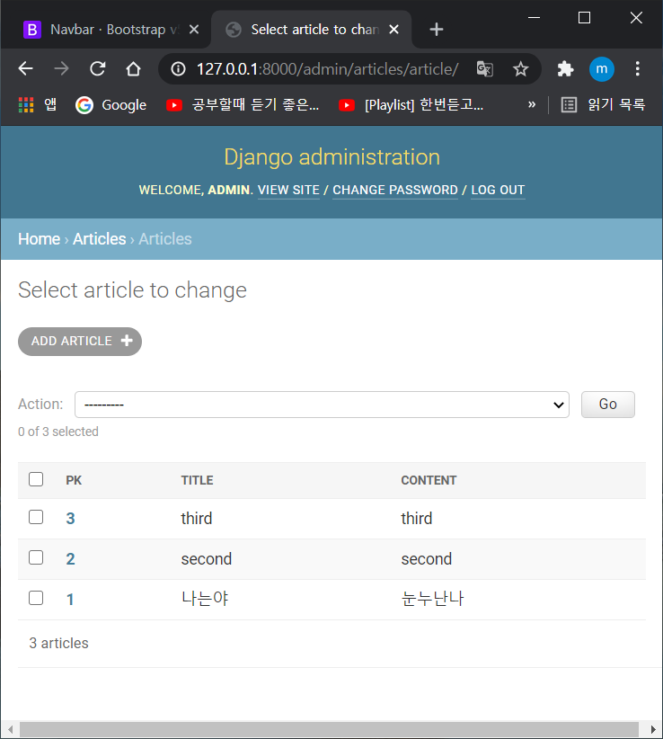
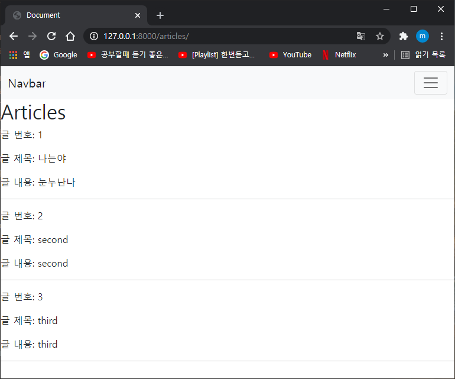
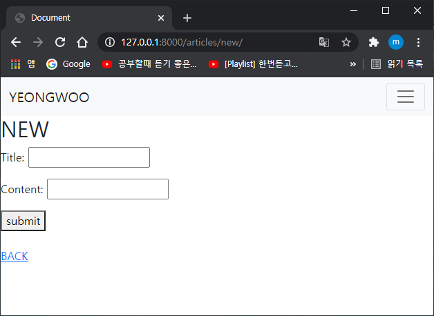
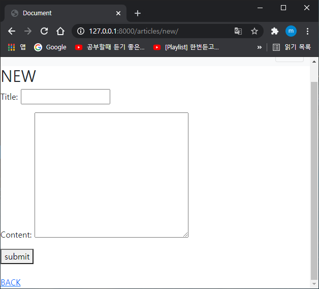

# django실습

맨처음 가상환경을 설정해준다.

```
$ python -m venv venv
$ source venv/Scripts/activate
```

그리고 django를 설치! 이렇게되면, 내가만든 가상의 공간에서 복잡하지 않게 그림을 그려낼수가 있음.

사실, 무슨차이인지 모르겠다만, 그러하다함..

```
$ pip install django
```

그리고 설치가 잘 되어있는지

```
$ pip list
```

확인 한번 해보기

```
$ pip list
Package    Version
---------- -------
asgiref    3.3.1  
Django     3.1.7  
pip        20.2.3 
pytz       2021.1 
setuptools 49.2.1 
sqlparse   0.4.1 
```

이렇게 장고가 설치가 잘 되어있는것을 확인했다면, 첫단계 intro부터 따라가보자.

# intro

프로젝트와 어플을 설정해줘야 하는데, 명령어는 알고있겠지?

```
$ django-admin startproject crud
$ python manage.py startapp articles
```

프로젝트 이름은 crud, 어플 이름은 articles라고 생성 완료!

app는 일반적으로 복수형으로 설정해주는것을 권장

* 까먹으면 안되는것 :  .py 3대장들(urls, views, models) 이 순서로 작성한다고 생각하면됨

얘네를 생성했으면 뭘해야될까?

app 등록해주기, 그리고 url분리해주기, base.html(html의 기본 틀) 생성

```python
# crud/settings.py

INSTALLED_APPS = [
    'articles',
```

```python
# crud/urls.py

from django.contrib import admin
from django.urls import path, include

urlpatterns = [
    path('admin/', admin.site.urls),
    path('articles/', include('articles.urls')),
]
```

```python
# articles/urls.py

from django.urls import path
from . import views

app_name = 'articles'
urlpatterns = [
    
]
```

```python
# templates/base.html

<!DOCTYPE html>
<html lang="en">
<head>
  <meta charset="UTF-8">
  <meta http-equiv="X-UA-Compatible" content="IE=edge">
  <meta name="viewport" content="width=device-width, initial-scale=1.0">
  <title>Document</title>
</head>
<body>
<nav class="navbar navbar-expand-lg navbar-light bg-light">
  <div class="container-fluid">
    <a class="navbar-brand" href="#">Navbar</a>
    <button class="navbar-toggler" type="button" data-bs-toggle="collapse" data-bs-target="#navbarNav" aria-controls="navbarNav" aria-expanded="false" aria-label="Toggle navigation">
      <span class="navbar-toggler-icon"></span>
    </button>
    <div class="collapse navbar-collapse" id="navbarNav">
      <ul class="navbar-nav">
        <li class="nav-item">
          <a class="nav-link active" aria-current="page" href="#">Home</a>
        </li>
        <li class="nav-item">
          <a class="nav-link" href="#">Features</a>
        </li>
        <li class="nav-item">
          <a class="nav-link" href="#">Pricing</a>
        </li>
        <li class="nav-item">
          <a class="nav-link disabled" href="#" tabindex="-1" aria-disabled="true">Disabled</a>
        </li>
      </ul>
    </div>
  </div>
</nav>


</body>
</html>
```

네비게이션바는 그냥 따온것이고, html을 생성해서 상속받으면 이 틀은 그대로 유지가 될것이다.

그리고 각각의 html마다 넣어줘야하는것들이 있는데 그것들은

```


```

이곳 사이에다가 넣어줘야하기 때문에, 미리 생성해준다. 각각내용들의 집 이라고 생각하면 된다.

이렇게 설정을 해주면, 이 경로를 등록해줘야된다.

```python
# crud/settings.py

TEMPLATES = [
    {
        'BACKEND': 'django.template.backends.django.DjangoTemplates',
        'DIRS': [BASE_DIR, 'templates'],
        'APP_DIRS': True,
        'OPTIONS': {
```

DIRS에 등록을 해주는데, 지금 위치하는 폴더가 crud와 articles와 같은 곳에 위치해서 바로 templates를 작성해주었지만, 더 안에 들어있다면 `'그 폴더' / 'templates'` 가 되어야한다.

그리고 DB를 생성해준다


이렇게 기초세팅은 끝이났다.

이제 첫 홈페이지부터 하나씩 만들어볼까?

순서는 이렇게 기억하자

urls > views > html

첫화면을 만들어보자

```python
# articles/urls.py

from django.urls import path
from . import views

app_name = 'articles'
urlpatterns = [
    path('', views.index, name='index'),
]
```

```python
# articles/views.py

from django.shortcuts import render

# Create your views here.
def index(request):
    return render(request, 'articles/index.html')
```

```python
# articles/templates/articles/index.html



  <h1>반갑습니다~</h1>

```

이렇게하면 첫화면이 따닥 나오게된다. extends는 상속받는 html이기때문에 무슨일이 있더라도 맨~위에 적어주는거 잊지말자.

어플을 두개만들때에는, app_name = ''을 설정해서, 링크에 url태그를 설정할때 \<a href="">보여질 이름</a>

이런식으로 :로 구분지어주면 헷갈리지 않고 잘 찾아갈 수 있다.

그리고 장고는 templates경로에 있는 파일만 찾을 수 있으며, INSTALLED_APPS에 작성한 순서대로 templates를 검색 후 렌더링함

intro는 생각보다 별게없다. 만드는게 있어서 기본적인 것으로 그냥 설정만 잘 해준다면 무리없이 해결할 수 있는 부분이었다.


# Model

그렇다면  이제 model을 설정하고, crud를 작성해보도록하자.

처음의 설정들은 무엇인가?

가상환경 설정, django설치, pjt, app생성, app등록, base.html생성, 등록, urls분리 이정도까지만 먼저 실행해주도록하자.

설정이 끝났으면 models.py를 정의하러가보는데

```python
from django.db import models

# Create your models here.
class Article(models.Model):
    title = models.CharField(max_length=10)
    content = models.TextField()
```

class설정해주고 모델이니까 Model로 틀을 잡아주면된다.

각 항목들은 열 로 매핑이 되는데, models니까 models.~~~ 이렇게 필드를 넣어주면된다. 글자수가 많을때에는 TextField를 사용해주면된다.

이렇게 다 만들고나면, migrate를 해주는데, 맨 처음에는 도면을 만들어준다 makemigrations. 그 다음 정상적으로 도면이 만들어졌다면 migrate를 해주면 데이터생성~

만약 변경사항이 생기게된다면, 수정 후 똑같은 작업을 하면 된다.

뭐라고 말이 막~ 나오는데 1엔터, 엔터 하고 migrate해주면된다.


DB를 편하게 조작할수 있도록 설치를 먼저 해준다.

```
$ pip install ipython django-extensions
```

그리고 settings.py에도 등록해준다.

이렇게 되면 도안은 만들어졌으니, 거기다가 정보를 집어넣어야겠지??

```
$ python manage.py shell_plus
```

실행 시킨 후

```
In [1]: 
```

이런 터미널이 생성될 것이다. 이제 여기다가 자유롭게 정보를 넣어줄 수 있는데,

첫번째방법

```
article = Article() # 클래스로부터 인스턴스를 생성해준다.
article.title = '정보' # 해당 인스턴스 변수를 설정 or 변경
article.save() # 정보 저장
```

두번째방법

```
article = Article(title='second', content='django!!')
article.save()
```

세번째방법

```
Article.objects.create(title='third', content='django!')
```

세번째방법은 save작업을 따로 해주지 않아도됨

쿼리셋은 리스트처럼 동작하는데, 

all()하면 쿼리셋이 나오고, 뒤에 [index]하면 그 id값이 나옴ㄷㄷ

get으로 id=N라던지 title='' 라던지, 이런식으로 어떤 id가 그건지 찾아낼 수 있음

값 찾아내려면 article = Article.objects.get(조건)하고나서 article검색하면 나옴

찾을때 id, id__exact, pk는 같은거임

변경하고싶다면, article값 찾아서  .변경하고픈열 = '변경값' 하고 저장해주면됨

* 모델class를 admin에 등록하기

  ```
  $ python manage.py createsuperuser
  ```

  그 다음 이것저것 뭐 쓰라는거 쓰면 됨

  ```python
  # articles/admin.py
  
  from django.contrib import admin
  from .models import Article
  
  # Register your models here.
  admin.site.register(Article)
  ```

  ```
  # articles/admin.py
  
  from django.contrib import admin
  from .models import Article
  
  class ArticleAdmin(admin.ModelAdmin):
      list_display = ('pk', 'title', 'content', 'created_at', 'updated_at',)
  
  admin.site.register(Article, ArticleAdmin)
  ```

  마지막 코드는, admin페이지에서 models.py서 정의한 각각의 속성들의 값을 출력한다고함

  목록을 보면

  

  훨씬 깔끔하게 보여준다


# CRUD

기본적으로 django에서의 첫발은 지금부터다

만들고 읽고 수정하고 삭제하고

이것들을 기본적으로 할수있어야한다.

일단 템플릿과 base.html을 설정해주고 거기다가 cdn넣어주기! + 앞서 말한 기본설정들도

그리고 이제 기본페이지를 설정해주자

* READ

```
# articles/urls.py

from django.urls import path
from . import views

app_name = 'articles'
urlpatterns = [
    path('', views.index, name='index'),
]
```

html도 설정해주고

```


<h1>Articles</h1>

  <p>글 번호: {{ article.pk }}</p>
  <p>글 제목: {{ article.title }}</p>
  <p>글 내용: {{ article.content }}</p>
  <hr>


```

views.py도 설정해주자

```
from django.shortcuts import render

# Create your views here.
def index(request):
    articles = Article.objects.all()
    context = {
        'articles':articles,
    }
    return render(request, 'articles/index.html', context)
```

이렇게해주면



첫 페이지는 완성이다. 이제 하나하나 고쳐가보자

* CREATE(생성)

new를 만들어주는데, 버튼을 클릭하면 생성페이지로 이동할 수 있도록 def new에는

new.html만 반환하면 될 것 같다.

```python


<h1>NEW</h1>
<form action="" method="POST">

<label for="title">title</label>
<input type="text" name="title" id="title"><br>
<label for="content">content</label>
<textarea name="content" id="content" cols="30" rows="10"></textarea><br>
<button>submit</button>
</form>
<br>
<a href="">BACK</a>

```

new페이지에서 정보를 넣어주기위해 label, input, textarea로 틀을 잡아주고, action(정보를 보내는곳)은 create함수로, 정보를 저장해주면됨. 밑의button을 눌러서 action을 수행해주면 됨

그리고 method는 POST로 받는데 GET과 다른점은, 데이터의 수정, 생성, 삭제가 이루어질 경우에는 POST로 받고 나머지 조회하는 링크를 통해서 이루어지는 것들은 GET으로 받으면됨.

```python
def create(request):
    title = request.POST.get('title')
    content = request.POST.get('content')

    article = Article(title=title, content=content)
    article.save()

    return redirect('articles:index')
```

이렇게하면 생성 완료~

마지막에 redirect를 해주는 이유는 render를 하게 되면 url이 돌아가지 않아서 그냥 단순히 index페이지를 출력해줌. 게시글이 조화되지가 않음...

* detail

```


<h1>DETAIL</h1>
<hr>
<h3>no.{{ article.pk}}</h3>
<h3>title: {{ article.title }}</h3>
<h3>content: {{ article.content }}</h3>
<hr>
<a href="">BACK</a>

```

detail도 별거 없다 그냥... 받은 pk값들 잘 활용해서 넣어주면 된다.

여기서 detail이 생성되었으니, create하고 난 뒤 detail로 돌아가보자

```
# views.py/def create

    return redirect('articles:detail', article.pk)
```

이렇게 해주면 article.pk값을 활용해 detail로 돌아갈 수 있다.

* edit

이것은 create와 별반 다를게 없긴하다. 하지만 차이점이라고 함은, 그 창에 article의 값들이 보여야 수정하기가 용이할 것이다.

```
def edit(request, pk):
    article = Article.objects.get(pk=pk)
    context = {
        'article':article,
    }
    return render(request, 'articles/edit.html', context)
```

일단 pk값으로 값 받아서 context에 넣어서 html을 반환시켜준다.

edit과 update는 한쌍으로 생각을 해주면 될 것 같다.

```
def update(request, pk):
    article = Article.objects.get(pk=pk)
    article.title = request.POST.get('title')
    article.content = request.POST.get('content')
    article.save()
    return redirect('articles:detail', article.pk)
```

pk로 값 가져오고, title은 request로 요청받은 title가져오고, content도 같이

그러고 save해주면 내가 요청한 값들로 저장이되어있을것이다. 그러고 redirect와 pk를 같이 반환해주면 될것이다. 여기서도 render가 아닌이유는 위와같지않을까..? url을 안돌렸기땜에..?

이렇게 CRUD는 마무리...!!!


# form

장고의 유효성 검사 도구들 중 하나이며, 공격 및 데이터 손상에 대한 중요한 방어 수단.

자 그럼 form를 만들어볼까?

* forms선언

```python
from django import forms

class ArticleForm(forms.Form):
    title = forms.CharField(max_length=10)
    content = forms.CharField()
```

model과 다를게없다고 생각이된다. 하지만 차이점이라함은 Form이라는점? 그리고 models가 아니라 forms를 불러와서 필드들을 소환하는것, 게다가 모델에서는 내가 입력하지 않는 auto부분까지도 해줬는데, 여기선 내가 직접 입력하는 부분만 추가해주면 된다.

그다음

```python
# articles/views.py

def new(request):
    form = ArticleForm()
    context = {
        'form':form,
    }
    return render(request, 'articles/index.html', context)
```

form에다가 우리가 만들어둔 ArticleForm을 담아준다. 

```python
class ArticleForm(forms.Form):
    title = forms.CharField(max_length=10)
    content = forms.CharField()
```

지금 여기 담겨있는 친구들이 얘네다. 얘네들을 얼마나 손쉽고 간편하게 나타내주는지 다음단계를보자.

쉽게 생각해서 그냥 내가 입력해서 받는거 아니고 원래있던애들을 form에다가 자연스레 옮겨줬다고 생각하면 될것같다. 가르치는 사람이 보면 이해못할수도있다. 하지만.. 난 이렇게해야 이해했다고 다음단계로 넘어갈수있기 때문에.... 그냥 일단 나아간다..

new.html로 와서 그 수많은 label과 input들.. 주절주절 적어놓은 것들이 있다.

걔네들보다는 {{ form.as_p}} 얘 하나로 하는게 훨씬 깔끔하지 않을까?

근데 내가 이렇게만 해두니까  칸이 너무 작게나온다.... 이 컨텐츠 칸을 키우려면??



forms/class/content로 가서 content = forms.CharField(widget=forms.Textarea)이렇게 수정해주면 



이렇게 칸이 커졌다 ;)

# ModelForm

form클래스를 상속받은 클래스

form과의 차이점은 모델과 필드를 지정하면 모델폼이 자동으로 폼필드를 생성해준다는 것이다.

form은 직접 필드를 정의하고 위젯 설정이 필요한 반면 더 편하다고 볼 수있다.(이해불가)...

그렇다면 modelform먼저 작성해보자.

```python
class ArticleForm(forms.ModelForm):
    class Meta:
        model = Article
        fields = '__all__'
        # 특정항목만 가져오고 싶다면
        # fields = ['항목', '항목']
```

생각보다 간단하다. Meta는 왜해주냐고? 해주라고한다. 그냥 궁금해하지말고 해줘라.

자 그럼 지금 ModelForm을 가져와서 이걸 활용해줄것인데, 어떻게해주냐? new와 create를 합쳐줄거다.

```python
def create(request):
    if request.method == 'POST':
        form = ArticleForm(request.POST) # 맞다면? 값을 저장
        if form.is_valid(): # 그리고 유효성검사를 해준다(조건에 맞게 데이터가 들어왔는지)
            article = form.save() # 알맞게 들어왔다면? 저장해준다.
            return redirect('articles:detail', article.pk) # 그리고 detail로 pk와함께 돌려준다
            
    else: # 메서드가 다르다면?
        form = ArticleForm() # 꿈뻑~꿈뻑~ 뭐 아무것도안하고 그냥 냅둔다...
    context = { # 얘는 유효성을 통과못하든, 메서드가 다르든 공통으로 들어가는 부분이라 앞으로빼줌
        'form':form,
    }
    return render(request, 'articles/create.html', context) # ??create.html이 ㅇㄷ?? new에서 이름변경을할것이기에
# 그렇게 new는 사라지게된다...
```

```python
def update(request, pk):
    article = Article.objects.get(pk=pk) # 일단 pk값으로 article의 정보를 미리 가져온다. 이건 수정이니까, 기존값이 존재해야지??
    if request.method == 'POST': # 메서드가 POST라면?
        form = ArticleForm(request.POST, instance=article) # form에 요청받은 값을 저장해주고, 기존의 값을 미리 보여줘야하기 때문에 instance를 설정해줌
        if form.is_valid(): # 유효성검사를해주자
            form.save() # 통과? 그래
            return redirect('articles:detail', article.pk)
    else:
        form = ArticleForm(instance=article)
    context = {
        'form':form, # 만약html에 article이 남아있다면 추가해야하지만, form.as_p로 자질구레한 아이들을 다 정리해줬기 때문에 거기에 article이 없어서 굳이 쓸모가없다. 그래서 생략가능
    }
    return render(request, 'articles/update.html', context)
```

create와 update를 각각 new와 edit이랑 합쳐주는 작업을 진행했다.

이렇게하면서, 합쳐줬으니 그럼 new와 edit의 흔적들을 빨랑 지워야겠지???

* 삭제 DELETE

```python
def delete(request, pk):
    article = Article.objects.get(pk=pk) # pk값으로 데이터 가져오고
    if request.method == 'POST': # POST라면?
        article.delete() # 데이터삭제, 저장따로안해도됨 자동으로 ㅎ
        return redirect('articles:index') # 데이터가 변형이 있다면 redirect
    return redirect('articles:detail', article.pk) # 이건왠지모르겠다만..ㅎ
```

근데이상하게 적용이안된다.... 그래서

form태그를 활용해서

```python
<form action="" method="POST">

<input type="submit" name="DELETE" id="DELETE" value="DELETE">
</form>
```

이렇게 넣어줬는데, 아마도 delete에 대한 method값이 들어가있지 않아서 그런거 같다.


그리고이제 forms를 커스터마이징? 할 수도 있다. 물론 난 안하고싶지만.... 알아는 둬야할테니

```
class="btn btn-primary" # 버튼색깔을 예쁘게 파랗게 만들어줌 ㅎㅎ
```

```
# articles/forms.py

class ArticleForm(forms.ModelForm):
    title = forms.CharField(
        label='제목',
        widget=forms.TextInput(
            attrs={
                'class': 'my-title form-control', 
                'placeholder': 'Enter the title',
        }),
    )
    content = forms.CharField(
        label='내용',
        widget=forms.Textarea(
            attrs={
                'class': 'my-content form-control',
                'placeholder': 'Enter the content',
                'rows': 5,
                'cols': 50,
        }),
        error_messages={
            'required': '내용 넣어라...',
        }
    )
```

얘는 forms에서 수정해주면 되는 부분인데, label은 나타내는 글자, widget설정, 그리고 widget에서 attrs를 통해 class설정해주고, placeholder로 아무것도 안쳤을때 뭐라고 나올지 설정도 가능하다.

저기 보이는 form-control을 넣어주게되면 존못네모창에서 예쁜커다란네모창으로 바뀐다. 꼭넣어줘라.

나머지 꾸미는거에 대해서는 솔직히 잘 모르겠음..;; 뭐라는건지.;;?

부트스트랩으로 꾸미는거에 진심인 마크다운.... 에잇

django-bootstrap5를 살펴보면

이건 일단 설치를 해줘야되는거같다

```
$ pip install django-bootstrap-v5
```

그리고 app등록또한 

```
  'bootstrap5',
```

requirement.txt만들어줄때에는

```
$ pip freeze > requirements.txt
```

간단하다 ㅎ

* view decorators

이건, 함수에 기능 추가할때 함수 수정 안하고 기능을 연장시켜주는 함수라고한다

뷰에 적용할 수 있는 여러 기능들이 있으니 살펴보자

* require_http_methods() : 일치하지 않는 메서드요청이라면 405 error를 발생

```
@require_http_methods(['GET', 'POST'])
def create(request):
    pass
```


* require_POST() : POST메서드요청만 승인

```
@require_POST
def delete(request, pk):
```


# static

이거뭔가?진짜모르겠다 짜증난다 아오...ㅠㅠ 난안꾸밀래ㅠ..

static files 구성할때의 4단계

1. django.contrib.staticfiles 앱이 `INSTALLED_APPS`에 있는지 확인
2. setting.py에 `STATIC_URL` 정의
3. 템플릿에서 static 템플릿 태그를 사용하여 static file이 있는 상대경로를 빌드
4. 앱에 static file 저장하기 (`my_app/static/my_app/sample.jpg`)

```




<h1>Articles</h1>

```

얼추.. 그림넣는것까지는 무난한것 같다. 경로지정해줄때, static/까지는 안써도된다.

static폴더에 앱이름으로 만들고 그안에 images/js/css 이렇게 다 나눠넣으면 될것같다.

그리고 forms.py에 image항목을 추가해준다.

```
image = models.ImageField(blank=True)
```

이걸 해준다음 pillow가 설치되어있는지 확인해주고, migrate를 해서 데이터를 저장해주면 된다.

blank=True : blank라도 허용한다. 빈값이 와도 괜찮다고한다. 데이터베이스에는 '' 빈문자열이 저장

```
<form action="" method="POST" enctype="multidata/form-data">
```

여기서 마지막 enctype은 파일/이미지 업로드 시에 반드시 사용해야한다(전송되는 데이터의 형식을 지정)

* 번외

  decorators사용할때 views.py에서

  ```
  from django.views.decorators.http import require_http_methods
  ```

  그 다음,@require_http_methods(['GET', 'POST']) 작성해주면된다.

  이 말은 GET과 POST만 받겠다는 것.

자 그럼 사진올리기위한것을 다시 정리해보자면

1.  setting.py에 `MEDIA_ROOT`, `MEDIA_URL` 설정

   ```
   MEDIA_ROOT = BASE_DIR / 'media'
   MEDIA_URL = '/media/' 
   ```

2. urls.py 설정

   ```
   from django.conf.urls.static import static
   
   + static(settings.MEDIA_URL, document_root=settings.MEDIA_ROOT)
   ```

3. 모델클래스에 image필드 추가, 그리고 migrate해주기

   ```
   image = models.ImageField(blank=True)
   ```

4. create(생성)할 때에, 메서드받을때 잉크타입도 같이받기(이미지파일받을때 필수)

   method 받는곳에 옆에 같이 써주면됨

   ```
   enctype="multipart/form-data"
   ```

5. views.py에서도 request받을 때에 files도 같이 받아주기

   ```
   form = ArticleForm(request.POST, request.FILES)
   ```

   update도 사진첨부가 가능해야겠지? update에서는 instance가 추가되어있을뿐이다.

   그 앞에다가 그냥 request.FILES꾸역꾸역 넣어주면됨

6. 그리고 마지막으로 받은 article의 정보를 요래조래 빼서 사용해주기

   ```
     
     # 업로드 파일의 상대 url, 업로드 파일의 파일 이름
   ```

   